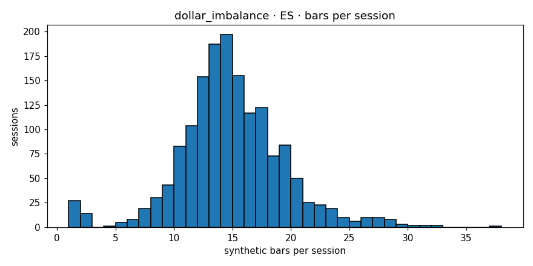

# Engine diagnostics  —  `dollar_imbalance`  on  **ES**

- asset class: **equity**  (family `sp500`)
- bars produced: **23,006**
- avg bars per session: **14.433** (spec §11.1 v1.1 band [12, 25]: PASS)
- median source bars per synthetic: **3**
- mean log-return: **0.000011**
- std log-return: **0.002530**
- source 5-min lag-1 autocorr: **-0.0161**
- synthetic   lag-1 autocorr: **-0.0214**
- autocorr gate (Amendment 1): **PASS**  (|synth_ac1|=0.0214 (src near zero |src_ac1|=0.0161, gate<=0.05))
- cross-session bars: **0**
- closing reason breakdown: **{'budget': 22940, 'session_end': 66}**
- **overall verdict: PASS**

