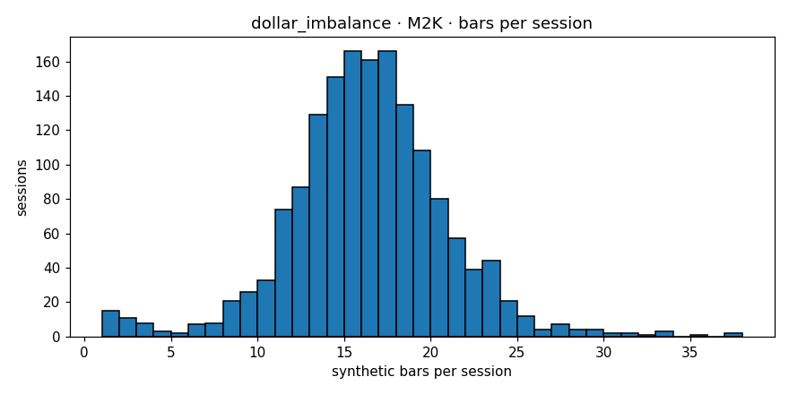

# Engine diagnostics  —  `dollar_imbalance`  on  **M2K**

- asset class: **equity**  (family `russell`)
- bars produced: **25,286**
- avg bars per session: **15.863** (spec §11.1 v1.1 band [12, 25]: PASS)
- median source bars per synthetic: **2**
- mean log-return: **-0.000013**
- std log-return: **0.003418**
- source 5-min lag-1 autocorr: **-0.0139**
- synthetic   lag-1 autocorr: **-0.0321**
- autocorr gate (Amendment 1): **PASS**  (|synth_ac1|=0.0321 (src near zero |src_ac1|=0.0139, gate<=0.05))
- cross-session bars: **0**
- closing reason breakdown: **{'budget': 24831, 'session_end': 455}**
- **overall verdict: PASS**

