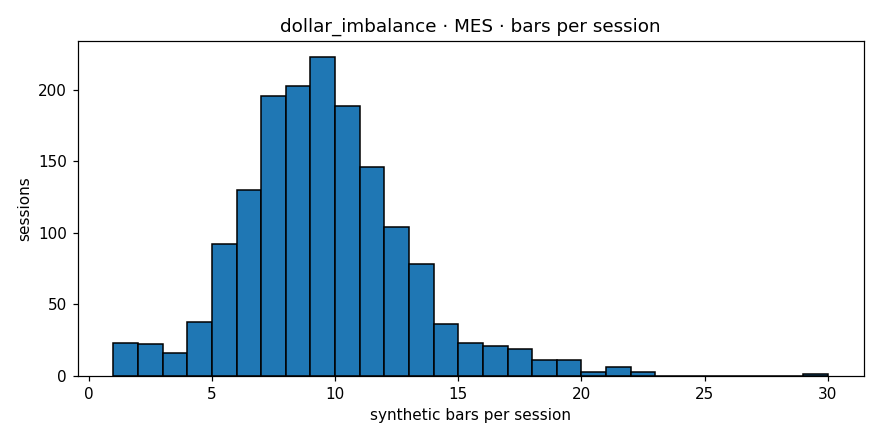

# Engine diagnostics  —  `dollar_imbalance`  on  **MES**

- bars produced: **14,464**
- avg bars per session: **9.074** (target band 4–30)
- median source bars per synthetic: **4**
- mean log-return: **0.000018**
- std log-return: **0.003105**
- lag-1 autocorrelation: **0.0102** (gate <0.3)
- cross-session bars: **0**
- closing reason breakdown: **{'budget': 13560, 'session_end': 904}**
- verdict: **PASS**

