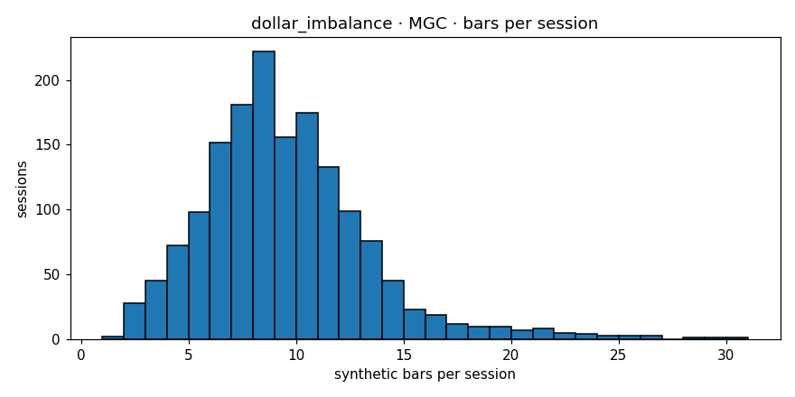

# Engine diagnostics  —  `dollar_imbalance`  on  **MGC**

- bars produced: **14,394**
- avg bars per session: **9.030** (target band 4–30)
- median source bars per synthetic: **3**
- mean log-return: **-0.000011**
- std log-return: **0.002315**
- lag-1 autocorrelation: **-0.0053** (gate <0.3)
- cross-session bars: **0**
- closing reason breakdown: **{'budget': 12935, 'session_end': 1458, 'max_bars': 1}**
- verdict: **PASS**

