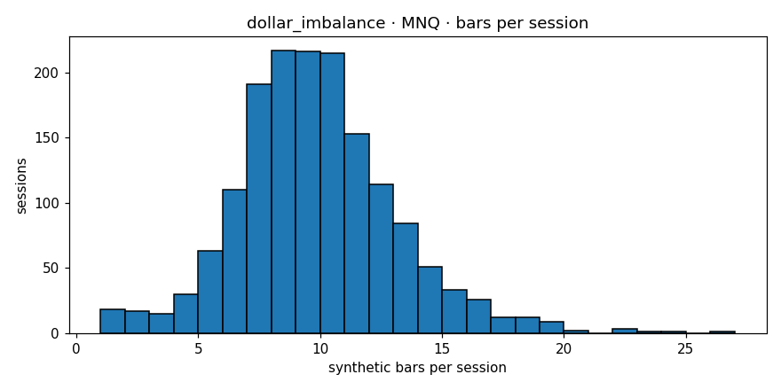

# Engine diagnostics  —  `dollar_imbalance`  on  **MNQ**

- bars produced: **14,897**
- avg bars per session: **9.346** (target band 4–30)
- median source bars per synthetic: **4**
- mean log-return: **0.000025**
- std log-return: **0.003866**
- lag-1 autocorrelation: **0.0001** (gate <0.3)
- cross-session bars: **0**
- closing reason breakdown: **{'budget': 13681, 'session_end': 1216}**
- verdict: **PASS**

