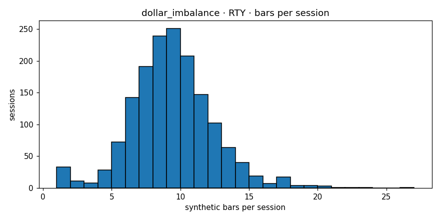

# Engine diagnostics  —  `dollar_imbalance`  on  **RTY**

- bars produced: **14,210**
- avg bars per session: **8.915** (target band 4–30)
- median source bars per synthetic: **4**
- mean log-return: **-0.000023**
- std log-return: **0.004570**
- lag-1 autocorrelation: **-0.0202** (gate <0.3)
- cross-session bars: **0**
- closing reason breakdown: **{'budget': 14134, 'session_end': 76}**
- verdict: **PASS**

