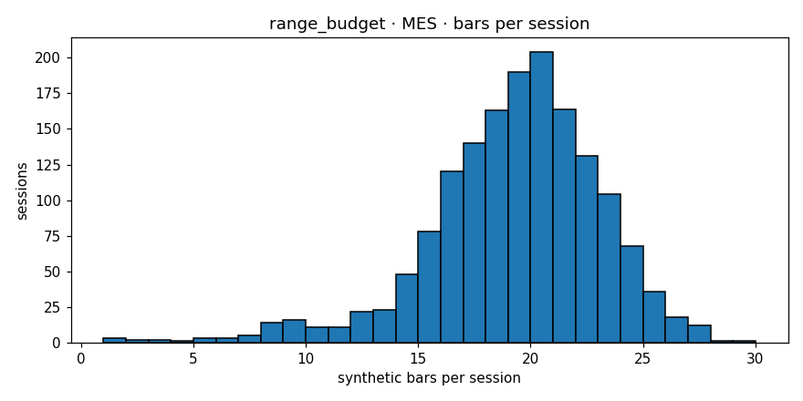

# Engine diagnostics  —  `range_budget`  on  **MES**

- asset class: **equity**  (family `sp500`)
- bars produced: **30,000**
- avg bars per session: **18.821** (spec §11.1 v1.1 band [12, 25]: PASS)
- median source bars per synthetic: **3**
- mean log-return: **0.000009**
- std log-return: **0.002200**
- source 5-min lag-1 autocorr: **-0.0162**
- synthetic   lag-1 autocorr: **-0.0175**
- autocorr gate (Amendment 1): **PASS**  (|synth_ac1|=0.0175 (src near zero |src_ac1|=0.0162, gate<=0.05))
- cross-session bars: **0**
- closing reason breakdown: **{'budget': 29208, 'session_end': 790, 'max_bars': 2}**
- **overall verdict: PASS**

