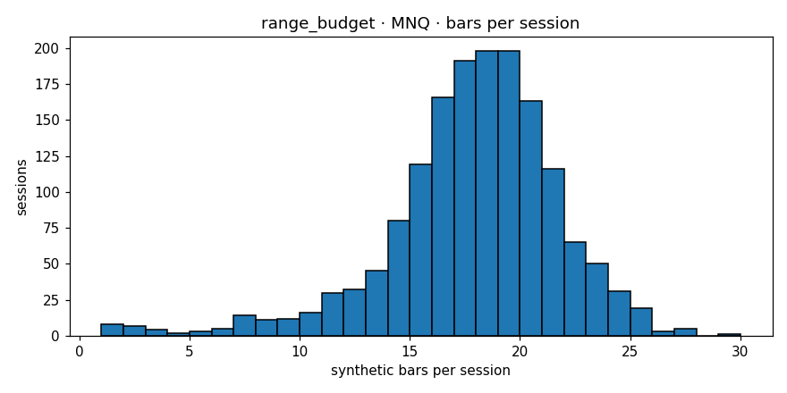

# Engine diagnostics  —  `range_budget`  on  **MNQ**

- asset class: **equity**  (family `nasdaq`)
- bars produced: **27,711**
- avg bars per session: **17.385** (spec §11.1 v1.1 band [12, 25]: PASS)
- median source bars per synthetic: **3**
- mean log-return: **0.000014**
- std log-return: **0.002847**
- source 5-min lag-1 autocorr: **-0.0046**
- synthetic   lag-1 autocorr: **+0.0012**
- autocorr gate (Amendment 1): **PASS**  (|synth_ac1|=0.0012 (src near zero |src_ac1|=0.0046, gate<=0.05))
- cross-session bars: **0**
- closing reason breakdown: **{'budget': 26763, 'session_end': 944, 'max_bars': 4}**
- **overall verdict: PASS**

