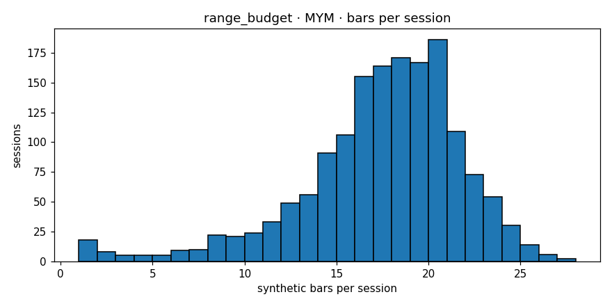

# Engine diagnostics  —  `range_budget`  on  **MYM**

- asset class: **equity**  (family `dow`)
- bars produced: **27,022**
- avg bars per session: **16.963** (spec §11.1 v1.1 band [12, 25]: PASS)
- median source bars per synthetic: **3**
- mean log-return: **0.000012**
- std log-return: **0.002229**
- source 5-min lag-1 autocorr: **-0.0085**
- synthetic   lag-1 autocorr: **-0.0175**
- autocorr gate (Amendment 1): **PASS**  (|synth_ac1|=0.0175 (src near zero |src_ac1|=0.0085, gate<=0.05))
- cross-session bars: **0**
- closing reason breakdown: **{'budget': 26205, 'session_end': 800, 'max_bars': 17}**
- **overall verdict: PASS**

