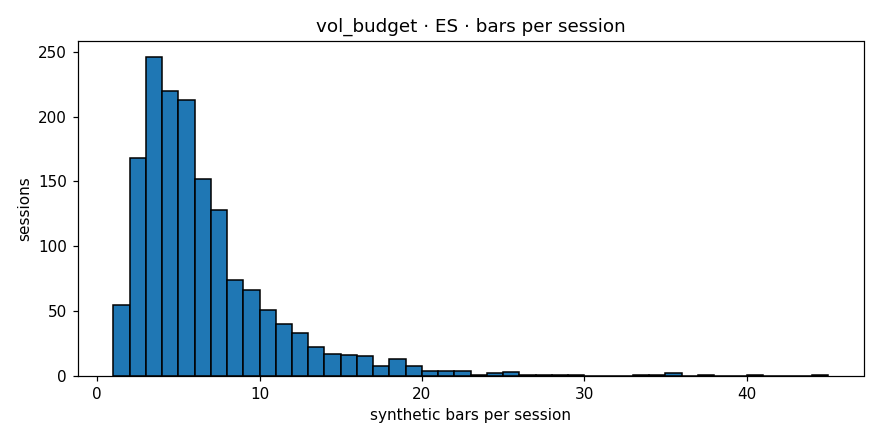

# Engine diagnostics  —  `vol_budget`  on  **ES**

- bars produced: **9,706**
- avg bars per session: **6.166** (target band 4–30)
- median source bars per synthetic: **8**
- mean log-return: **0.000028**
- std log-return: **0.003905**
- lag-1 autocorrelation: **-0.0255** (gate <0.3)
- cross-session bars: **0**
- closing reason breakdown: **{'budget': 8360, 'session_end': 1335, 'max_bars': 11}**
- verdict: **PASS**

