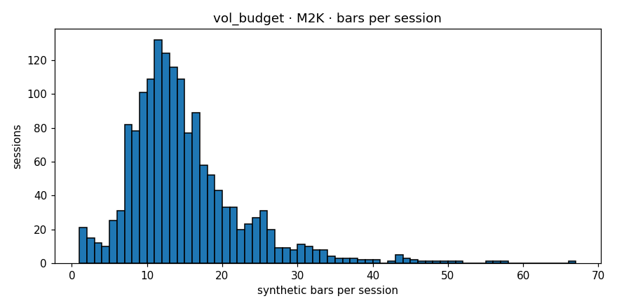

# Engine diagnostics  —  `vol_budget`  on  **M2K**

- asset class: **equity**  (family `russell`)
- bars produced: **22,777**
- avg bars per session: **14.471** (spec §11.1 v1.1 band [12, 25]: PASS)
- median source bars per synthetic: **4**
- mean log-return: **-0.000015**
- std log-return: **0.003636**
- source 5-min lag-1 autocorr: **-0.0139**
- synthetic   lag-1 autocorr: **-0.0271**
- autocorr gate (Amendment 1): **PASS**  (|synth_ac1|=0.0271 (src near zero |src_ac1|=0.0139, gate<=0.05))
- cross-session bars: **0**
- closing reason breakdown: **{'budget': 21511, 'session_end': 1266}**
- **overall verdict: PASS**

