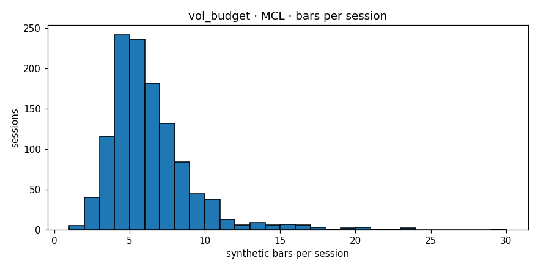

# Engine diagnostics  —  `vol_budget`  on  **MCL**

- bars produced: **6,961**
- avg bars per session: **5.889** (target band 4–30)
- median source bars per synthetic: **10**
- mean log-return: **-0.000133**
- std log-return: **0.006564**
- lag-1 autocorrelation: **0.0210** (gate <0.3)
- cross-session bars: **0**
- closing reason breakdown: **{'budget': 5936, 'session_end': 1023, 'max_bars': 2}**
- verdict: **PASS**

