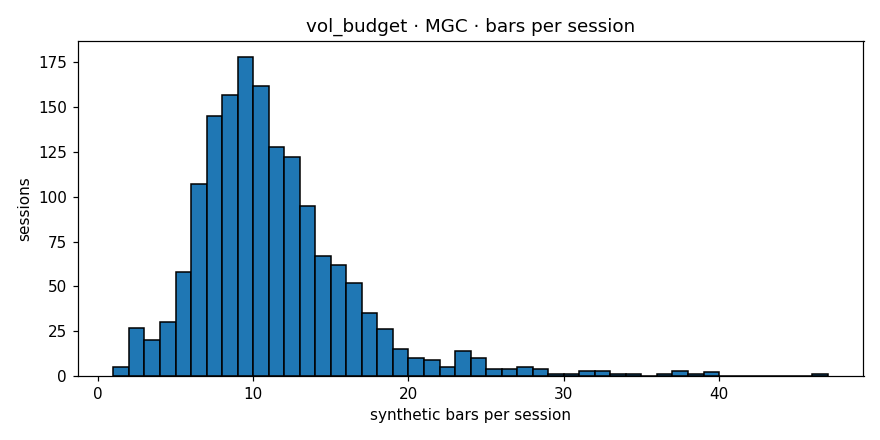

# Engine diagnostics  —  `vol_budget`  on  **MGC**

- asset class: **commodity**  (family `gold`)
- bars produced: **16,955**
- avg bars per session: **10.772** (spec §11.1 v1.1 band [10, 20]: PASS)
- median source bars per synthetic: **4**
- mean log-return: **-0.000009**
- std log-return: **0.002119**
- source 5-min lag-1 autocorr: **-0.0070**
- synthetic   lag-1 autocorr: **+0.0038**
- autocorr gate (Amendment 1): **PASS**  (|synth_ac1|=0.0038 (src near zero |src_ac1|=0.0070, gate<=0.05))
- cross-session bars: **0**
- closing reason breakdown: **{'budget': 15570, 'session_end': 1382, 'max_bars': 3}**
- **overall verdict: PASS**

