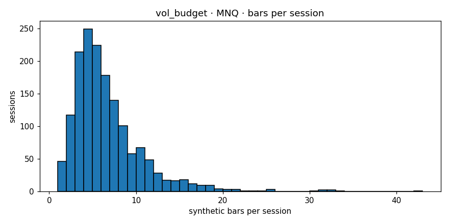

# Engine diagnostics  —  `vol_budget`  on  **MNQ**

- bars produced: **9,746**
- avg bars per session: **6.192** (target band 4–30)
- median source bars per synthetic: **9**
- mean log-return: **0.000037**
- std log-return: **0.004870**
- lag-1 autocorrelation: **-0.0041** (gate <0.3)
- cross-session bars: **0**
- closing reason breakdown: **{'budget': 8309, 'session_end': 1432, 'max_bars': 5}**
- verdict: **PASS**

