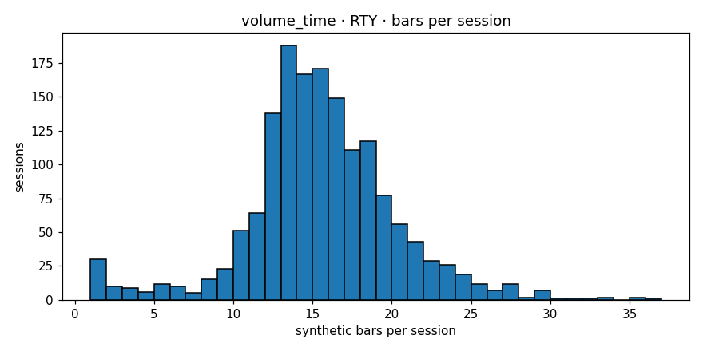

# Engine diagnostics  —  `volume_time`  on  **RTY**

- asset class: **equity**  (family `russell`)
- bars produced: **23,685**
- avg bars per session: **15.048** (spec §11.1 v1.1 band [12, 25]: PASS)
- median source bars per synthetic: **4**
- mean log-return: **-0.000014**
- std log-return: **0.003503**
- source 5-min lag-1 autocorr: **-0.0116**
- synthetic   lag-1 autocorr: **-0.0175**
- autocorr gate (Amendment 1): **PASS**  (|synth_ac1|=0.0175 (src near zero |src_ac1|=0.0116, gate<=0.05))
- cross-session bars: **0**
- closing reason breakdown: **{'budget': 23558, 'session_end': 127}**
- **overall verdict: PASS**

