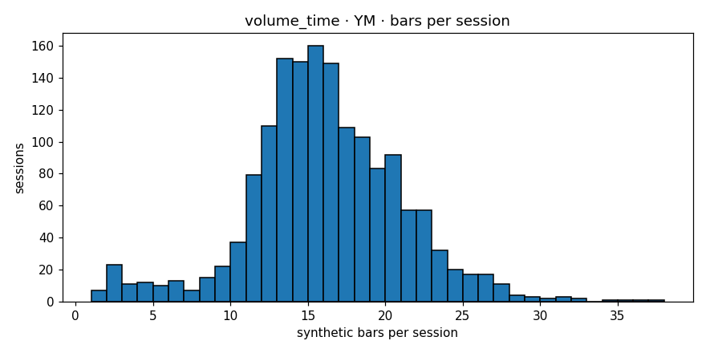

# Engine diagnostics  —  `volume_time`  on  **YM**

- asset class: **equity**  (family `dow`)
- bars produced: **24,561**
- avg bars per session: **15.614** (spec §11.1 v1.1 band [12, 25]: PASS)
- median source bars per synthetic: **4**
- mean log-return: **0.000012**
- std log-return: **0.002296**
- source 5-min lag-1 autocorr: **-0.0048**
- synthetic   lag-1 autocorr: **-0.0270**
- autocorr gate (Amendment 1): **PASS**  (|synth_ac1|=0.0270 (src near zero |src_ac1|=0.0048, gate<=0.05))
- cross-session bars: **0**
- closing reason breakdown: **{'budget': 23881, 'session_end': 680}**
- **overall verdict: PASS**

